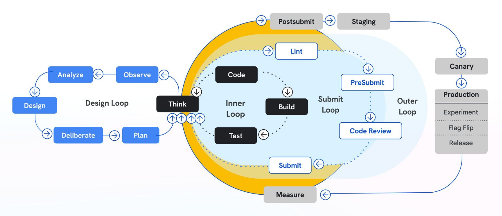
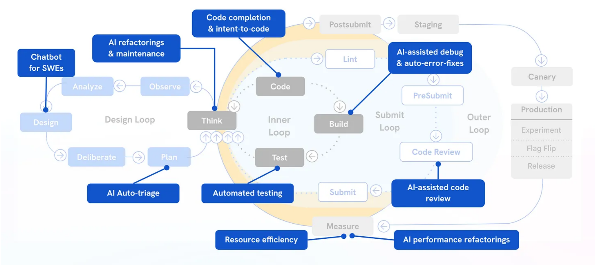

# VibeCode Lifecycle Automation

This project automates the **VibeCode Lifecycle**, a disciplined 18-step workflow for high-context coding with PRD, Git Ingest, and ERD phases.

## 🚀 Quick Start

### Prerequisites

1. **Python 3.9+** - For enforcement scripts
2. **Claude Code** - v2.1.16+ (for native Task support)

### Installation Options

#### Option 1: Clone for New Projects

```bash
git clone <repo-url>/VibeCodeWorkflow2026.git my-new-project
cd my-new-project
# /vibecodeworkflow command is now available
```

#### Option 2: Copy to Existing Project

```bash
# Copy enforcement infrastructure to your project
cp -r VibeCodeWorkflow2026/.claude /path/to/your/project/
cp -r VibeCodeWorkflow2026/.agent /path/to/your/project/
cp -r VibeCodeWorkflow2026/scripts/enforcement /path/to/your/project/scripts/
cp VibeCodeWorkflow2026/CLAUDE.md /path/to/your/project/
```

#### Option 3: Global Installation (Recommended for Personal Use)

Install commands globally so `/vibecodeworkflow` works in **any project**:

**macOS/Linux:**
```bash
# Create global commands folder
mkdir -p ~/.claude/commands

# Copy commands globally
cp VibeCodeWorkflow2026/.claude/commands/*.md ~/.claude/commands/

# Verify installation
ls ~/.claude/commands/
# Should show: vibecodeworkflow.md, add-feature.md, remind.md, status.md
```

**Windows (PowerShell):**
```powershell
# Create global commands folder
New-Item -ItemType Directory -Force -Path "$HOME\.claude\commands"

# Copy commands globally
Copy-Item VibeCodeWorkflow2026\.claude\commands\*.md "$HOME\.claude\commands\"

# Verify installation
Get-ChildItem "$HOME\.claude\commands"
```

**After global installation**, copy `CLAUDE.md` to each project where you want to use the workflow:
```bash
cp VibeCodeWorkflow2026/CLAUDE.md /path/to/your/project/
```

### Verify Installation

```bash
# Check state manager
python scripts/enforcement/vibe-cli.py status

# Or simply run the workflow command in Claude Code
/vibecodeworkflow
```

### Usage

Once installed, start the workflow in Claude Code:

```
/vibecodeworkflow
```

This will:
1. Create 9 planning tasks with proper dependencies
2. Start you at Step 0: Problem Statement
3. Ask "What would you like to build or accomplish today?"

#### Available Commands

| Command | Purpose |
|---------|---------|
| `/vibecodeworkflow` | Initialize the full 18-step workflow |
| `/add-feature <name>` | Add a feature task group (context → implement → test → review → commit) |
| `/remind` | Re-read CLAUDE.md and refresh workflow rules |
| `/status` | Check current step and what actions are allowed |

---

## 🛡️ Enforcement Architecture

The VibeCode Lifecycle is **automatically enforced** through a multi-layer architecture that prevents Claude from forgetting steps or skipping gates.

### The Problem: Context Drift

As AI coding sessions progress, Claude may:
- Forget the current workflow step
- Skip verification gates
- Edit code before context packing
- Commit without human approval

### The Solution: Multi-Layer Enforcement

```
┌─────────────────────────────────────────────────────────────────┐
│                     ENFORCEMENT LAYERS                          │
├─────────────────────────────────────────────────────────────────┤
│ Layer 1: CLAUDE.md          │ Orchestration rules (survives     │
│                             │ compaction, high attention priority)│
├─────────────────────────────────────────────────────────────────┤
│ Layer 2: Native Tasks       │ Dependency DAG with blockedBy      │
│                             │ TaskList for current state         │
├─────────────────────────────────────────────────────────────────┤
│ Layer 3: Hooks              │ PreToolUse gates, PostToolUse      │
│                             │ verification, SessionStart reload  │
├─────────────────────────────────────────────────────────────────┤
│ Layer 4: File State         │ vibe-state.json persists across    │
│                             │ sessions and compaction            │
└─────────────────────────────────────────────────────────────────┘
```

---

## 📁 Directory Structure

```
your-project/
├── .claude/
│   └── settings.local.json     # Hook configuration
├── .agent/
│   ├── work/
│   │   ├── vibe-state.json     # Persistent workflow state
│   │   ├── step-history.jsonl  # Append-only history log
│   │   └── backups/            # State backups
│   └── workflows/
│       ├── prd.md              # Product Requirements Document (Step 2)
│       ├── repo-context.md     # Git Ingest output (Step 4)
│       ├── erd.md              # Engineering Requirements Document (Step 5)
│       ├── plan.md             # Implementation plan (Step 6)
│       └── context-pack.md     # Current task context (Step 10)
├── scripts/
│   └── enforcement/
│       ├── config.py           # Step definitions & constraints
│       ├── state_manager.py    # State persistence logic
│       ├── vibe-cli.py         # Manual CLI commands
│       ├── check-step-validation.py    # PreToolUse hook
│       ├── reload-state.py     # SessionStart hook
│       ├── save-state-before-compact.py # PreCompact hook
│       └── ...                 # Other hooks
└── CLAUDE.md                   # Orchestration controller
```

---

## ⚙️ Configuration

### Hooks (`.claude/settings.local.json`)

The hooks file defines automatic triggers:

| Hook | Trigger | Purpose |
|------|---------|---------|
| `SessionStart` | Session begins | Reload state, print summary |
| `UserPromptSubmit` | Every prompt | Inject current step reminder |
| `PreToolUse:Edit\|Write` | Before code edit | Validate Step ≥ 11 |
| `PreToolUse:git commit` | Before commit | Validate approval |
| `PostToolUse:Edit` | After code edit | Invalidate tests, log edit |
| `PostToolUse:TaskUpdate` | Task status change | Sync to vibe-state.json |
| `PreCompact` | Before compaction | Backup state |
| `Stop` | Session ends | Save final state |

### State File (`vibe-state.json`)

```json
{
  "current_step": 7,
  "current_bead_id": "B4",
  "problem_statement": "...",
  "verification": {
    "tests_passed": false,
    "lint_passed": false
  },
  "approvals": {
    "spec_md": true,
    "plan_md": true,
    "human_review": false
  },
  "context": {
    "context_pack_exists": true,
    "task_selected": true
  }
}
```

### Temporal Constraints (`config.py`)

```python
TEMPORAL_CONSTRAINTS = {
    "git_ingest": {"min_step": 4, "requires": ["prd_approved"]},
    "generate_erd": {"min_step": 5, "requires": ["repo_context_exists"]},
    "generate_plan": {"min_step": 6, "requires": ["erd_exists"]},
    "edit_code": {"min_step": 11, "requires": ["context_pack_exists"]},
    "commit": {"min_step": 17, "requires": ["tests_passed", "human_approved"]},
    "push": {"min_step": 18, "requires": ["committed"]}
}
```

---

## 🔧 CLI Commands

Manual state management via `vibe-cli.py`:

```bash
# Show current state
python scripts/enforcement/vibe-cli.py status

# Set workflow step (0-18)
python scripts/enforcement/vibe-cli.py set-step 11

# Grant human approval (Step 15)
python scripts/enforcement/vibe-cli.py approve

# Revoke approval
python scripts/enforcement/vibe-cli.py revoke

# Mark tests as passed (Step 12)
python scripts/enforcement/vibe-cli.py tests-pass

# Mark context pack complete (Step 10)
python scripts/enforcement/vibe-cli.py context-pack

# Select a task/bead
python scripts/enforcement/vibe-cli.py select-task B4

# Reset to initial state
python scripts/enforcement/vibe-cli.py reset

# Create backup
python scripts/enforcement/vibe-cli.py backup
```

---

## 🚫 Enforcement Gates (7 Gates)

### Gate 1: No Code Before Step 11

```
IF current_step < 11:
    ❌ BLOCKED: Edit/Write operations
    REASON: "Code editing requires Step 11 (Implementation). Current: Step N"
```

### Gate 2: PRD Approval Before Git Ingest

```
IF action == "git_ingest" AND NOT prd_approved:
    ❌ BLOCKED: Git Ingest
    REASON: "Step 3 (PRD Approval) must complete first"
```

### Gate 3: Repo Context Before ERD

```
IF action == "generate_erd" AND NOT (exists("repo-context.md") OR greenfield):
    ❌ BLOCKED: ERD Generation
    REASON: "Step 4 (Git Ingest) must complete first, or mark as greenfield"
```

### Gate 4: ERD Before Plan

```
IF action == "generate_plan" AND NOT exists("erd.md"):
    ❌ BLOCKED: Plan Generation
    REASON: "Step 5 (Generate ERD) must complete first"
```

### Gate 5: Context Pack Required

```
IF action == "implement" AND NOT exists("context-pack.md"):
    ❌ BLOCKED: Implementation
    REASON: "Step 10 (Context Packing) must complete first"
```

### Gate 6: Tests Before Commit

```
IF action == "git commit" AND NOT tests_passed:
    ❌ BLOCKED: Commit
    REASON: "Step 12 (Verification) must pass"
```

### Gate 7: Human Approval Required

```
IF action == "git commit" AND NOT human_approved:
    ❌ BLOCKED: Commit
    REASON: "Step 15 (Human Review) approval required"
```

---

## 📋 Workflow Steps (18-Step Lifecycle)

| Step | Name | Code Edit? | Gate | Artifact |
|------|------|------------|------|----------|
| 0 | Problem Statement | ❌ | None | - |
| 1 | Discovery Q&A | ❌ | None | - |
| 2 | Write PRD | ❌ | None | `prd.md` |
| 3 | PRD Approval Gate | ❌ | **Stakeholder "yes"** | approval record |
| 4 | Git Ingest & Repo Context | ❌ | PRD approved | `repo-context.md` |
| 5 | Generate ERD | ❌ | Repo context exists | `erd.md` |
| 6 | Generate plan.md | ❌ | ERD exists | `plan.md` |
| 7 | Plan Critique | ❌ | None | - |
| 8 | Rules/Guardrails | ❌ | None | - |
| 9 | Select Task | ❌ | Task selected | - |
| 10 | Context Packing | ❌ | context-pack.md | `context-pack.md` |
| 11 | **Implementation** | ✅ | Context verified | code files |
| 12 | Run Tests | ✅ | Tests pass | test results |
| 13 | GREEN Check | ✅ | All green | - |
| 14 | Debug Loop | ✅ | None | - |
| 15 | Human Review | ❌ | Human approval | - |
| 16 | Second Review | ❌ | None | - |
| 17 | Commit | ❌ | Approval verified | git commit |
| 18 | Loop/Merge | ❌ | None | - |

**Key Terms:**
- **PRD** = Product Requirements Document (business requirements, user stories)
- **ERD** = Engineering Requirements Document (technical requirements, API contracts, data models)
- **Git Ingest** = Analyze existing codebase for patterns and context (skip if greenfield)

---

## 🔄 Session Management

### Starting a New Session

The `SessionStart` hook automatically:
1. Loads state from `vibe-state.json`
2. Checks if `context-pack.md` exists
3. Prints workflow status summary

### Context Compaction

When context exceeds ~70%:
1. `PreCompact` hook saves state backup
2. Claude compacts context
3. State is preserved in files
4. Next prompt reloads state

### Resuming Sessions

```bash
# Resume with full context
claude --continue

# Or resume specific session
claude --resume
```

State is automatically loaded via `SessionStart` hook.

---

## VibeCode Lifecycle Diagram





## Detailed Workflow (18 Steps)

```text
┌───────────────────────────────────────────────────────────────────────────────────────────────┐
│                                     OUTCOMES (ARTIFACTS)                                      │
│   prd.md    repo-context.md    erd.md    plan.md    context-pack.md    tests/    commits/    │
│                                                      (per task)       checks     history     │
└───────────────────────────────────────────────────────────────────────────────────────────────┘

┌───────────────────────────────────────────────────────────────────────────────────────────────┐
│ 0) START: Problem / Idea                                                                      │
│    WHAT: Define the problem statement and boundaries                                          │
│    WHY: Prevent vague prompting that causes drift                                             │
│    OUTPUT: 1–3 sentence problem statement                                                     │
└───────────────────────────────────────────────────────────────────────────────────────────────┘
                         │
                         v
┌───────────────────────────────────────────────────────────────────────────────────────────────┐
│ 1) OUTCOME + CONSTRAINTS DISCOVERY (AI asks you questions)                                    │
│    WHAT: Clarify success criteria, non-goals, constraints, risks, edge cases                  │
│    WHY: Forces shared understanding; reduces hallucination + rework                           │
│    OUTPUT: Requirements list + edge cases + invariants                                        │
└───────────────────────────────────────────────────────────────────────────────────────────────┘
                         │
                         v
┌───────────────────────────────────────────────────────────────────────────────────────────────┐
│ 2) WRITE PRD (Product Requirements Document)                                                  │
│    WHAT: Product vision, user stories, acceptance criteria, success metrics                   │
│    WHY: Gives a stable "source of truth" for business requirements                            │
│    OUTPUT: .agent/workflows/prd.md                                                            │
└───────────────────────────────────────────────────────────────────────────────────────────────┘
                         │
                         v
┌───────────────────────────────────────────────────────────────────────────────────────────────┐
│ 3) PRD APPROVAL GATE ⛔                                                                       │
│    WHAT: Get explicit stakeholder approval on the PRD                                         │
│    WHY: Prevents costly pivots later; ensures alignment before engineering                    │
│    OUTPUT: Approval record (who approved, when)                                               │
│    GATE: Must receive explicit "yes" before proceeding                                        │
└───────────────────────────────────────────────────────────────────────────────────────────────┘
                         │
                         v
┌───────────────────────────────────────────────────────────────────────────────────────────────┐
│ 4) GIT INGEST & REPO CONTEXT (skip if greenfield)                                             │
│    WHAT: Analyze existing codebase - structure, patterns, dependencies, integration points    │
│    WHY: Can't engineer solutions without knowing what exists                                  │
│    OUTPUT: .agent/workflows/repo-context.md                                                   │
└───────────────────────────────────────────────────────────────────────────────────────────────┘
                         │
                         v
┌───────────────────────────────────────────────────────────────────────────────────────────────┐
│ 5) GENERATE ERD (Engineering Requirements Document)                                           │
│    WHAT: Technical requirements, system constraints, API contracts, data models, NFRs         │
│    WHY: Translates business requirements into engineering specifications                      │
│    OUTPUT: .agent/workflows/erd.md                                                            │
└───────────────────────────────────────────────────────────────────────────────────────────────┘
                         │
                         v
┌───────────────────────────────────────────────────────────────────────────────────────────────┐
│ 6) GENERATE plan.md FROM PRD + ERD                                                            │
│    WHAT: Break work into small tasks with acceptance criteria per task                        │
│    WHY: Enables chunking; keeps execution controlled                                          │
│    OUTPUT: .agent/workflows/plan.md                                                           │
└───────────────────────────────────────────────────────────────────────────────────────────────┘
                         │
                         v
┌───────────────────────────────────────────────────────────────────────────────────────────────┐
│ 7) PLAN CRITIQUE + REFINEMENT LOOP                                                            │
│    WHAT: Review plan against PRD, ERD, and repo context for gaps/risks                        │
│    WHY: Fixes issues before code exists; cheaper than refactoring later                       │
│    OUTPUT: Updated plan.md + test checklist per step                                          │
└───────────────────────────────────────────────────────────────────────────────────────────────┘
                         │
                         v
┌───────────────────────────────────────────────────────────────────────────────────────────────┐
│ 8) RULES / STYLE / GUARDRAILS (project-level)                                                 │
│    WHAT: Coding conventions, forbidden patterns, "if unsure ask", how to run tests            │
│    WHY: Consistent code + less drift; reduces re-explaining every prompt                      │
│    OUTPUT: rules.md or CLAUDE.md updates                                                      │
└───────────────────────────────────────────────────────────────────────────────────────────────┘
                         │
                         v

        ┌────────────────────────────────────────────────────────────────────────────┐
        │                 EXECUTION PHASE: SMALL CHUNKS (per task loop)              │
        └────────────────────────────────────────────────────────────────────────────┘

┌───────────────────────────────────────────────────────────────────────────────────────────────┐
│ 9) SELECT TASK N (from plan.md)                                                               │
│    WHAT: Choose one small task: implement 1 function, fix 1 bug, add 1 feature                │
│    WHY: LLMs perform best on focused prompts; you can understand output                       │
│    OUTPUT: "Task card" (goal + done criteria)                                                 │
└───────────────────────────────────────────────────────────────────────────────────────────────┘
                         │
                         v
┌───────────────────────────────────────────────────────────────────────────────────────────────┐
│ 10) CONTEXT PACKING (per task)                                                                │
│    WHAT: Provide relevant code + interfaces + constraints + pitfalls                          │
│         - files to modify / reference                                                         │
│         - invariants & non-goals                                                              │
│         - relevant docs / API snippets                                                        │
│    WHY: Prevents guessing; improves correctness + fit; saves tokens by focusing               │
│    OUTPUT: .agent/workflows/context-pack.md                                                   │
└───────────────────────────────────────────────────────────────────────────────────────────────┘
                         │
                         v
┌───────────────────────────────────────────────────────────────────────────────────────────────┐
│ 11) IMPLEMENT TASK N (AI pair programmer) ✅ CODE EDITING ALLOWED                             │
│    WHAT: Generate/modify code for Task N only                                                 │
│    WHY: Controlled change set; easy to review                                                 │
│    OUTPUT: Code changes (small diff)                                                          │
│    GATE: Context pack must exist                                                              │
└───────────────────────────────────────────────────────────────────────────────────────────────┘
                         │
                         v
┌───────────────────────────────────────────────────────────────────────────────────────────────┐
│ 12) RUN TESTS / CHECKS (automated loop)                                                       │
│    WHAT: Execute unit tests, lint, typecheck, build                                           │
│    WHY: AI "sounds right" even when wrong; tests are the safety net                           │
│    OUTPUT: Pass/Fail logs                                                                     │
└───────────────────────────────────────────────────────────────────────────────────────────────┘
                         │
                         v
                 ┌──────────────────────────────┐
                 │ 13) GREEN?                   │
                 └──────────────────────────────┘
                      │               │
                    NO│               │YES
                      v               v
┌──────────────────────────────────────────────────────────┐   ┌────────────────────────────────────────────────────────┐
│ 14) DEBUG WITH LOGS (tight feedback loop)                │   │ 15) HUMAN REVIEW (accountability gate) ⛔              │
│    Paste failures + traces; AI proposes fix; re-run      │   │  - Can you explain it?                                 │
│    WHY: AI excels at iterate→test→fix with logs          │   │  - Is it simple/maintainable?                          │
│    OUTPUT: Updated code until green                      │   │  OUTPUT: Approved diff (or request simplification)     │
└──────────────────────────────────────────────────────────┘   │  GATE: Must say "yes" to approve                       │
                      │                                        └────────────────────────────────────────────────────────┘
                      └───────────────(back to step 12)────────────────────┘
                                                      │
                                                      v
┌───────────────────────────────────────────────────────────────────────────────────────────────┐
│ 16) OPTIONAL SECOND MODEL REVIEW (quality/security/perf)                                      │
│    WHAT: Different model/agent critiques diffs + suggests improvements                        │
│    WHY: "Second opinion" catches what first model missed                                      │
│    OUTPUT: Review notes + patch suggestions                                                   │
└───────────────────────────────────────────────────────────────────────────────────────────────┘
                                                      │
                                                      v
┌───────────────────────────────────────────────────────────────────────────────────────────────┐
│ 17) COMMIT (save point) ⛔                                                                    │
│    WHAT: Small commit, clear message. Never commit what you can't explain                     │
│    WHY: Rollback safety net; audit trail for AI changes                                       │
│    OUTPUT: Clean git history                                                                  │
│    GATE: Human approval + tests passed required                                               │
└───────────────────────────────────────────────────────────────────────────────────────────────┘
                                                      │
                                                      v
┌───────────────────────────────────────────────────────────────────────────────────────────────┐
│ 18) NEXT TASK?                                                                                │
│    If plan.md has more tasks → loop to Step 9                                                 │
│    If done → PR/Merge with CI gates + review                                                  │
│    OUTPUT: PR/merge + shipped increment                                                       │
└───────────────────────────────────────────────────────────────────────────────────────────────┘
```

---

## 🔬 How It Works

### 1. State Persistence

```
Session Start → Hooks load vibe-state.json → Claude knows current step
                                           ↓
Prompt Submitted → Hook injects "[VibeCode Step N]" reminder
                                           ↓
Edit Attempted → PreToolUse validates step ≥ 11
                                           ↓
Edit Completed → PostToolUse logs edit, invalidates tests
                                           ↓
Task Completed → PostToolUse syncs to vibe-state.json
                                           ↓
Compaction → PreCompact saves backup
                                           ↓
Session End → Stop hook saves final state
```

### 2. Gate Enforcement

```python
# PreToolUse hook for Edit/Write
def check_edit_allowed():
    state = load_state()
    if state.current_step < 11:
        print("❌ BLOCKED: Code editing requires Step 11+")
        exit(1)  # Blocks the tool call
    if not state.context_pack_exists:
        print("❌ BLOCKED: context-pack.md required")
        exit(1)
```

### 3. Task Synchronization

```python
# PostToolUse hook for TaskUpdate
def sync_task_to_state(task_update):
    if task_update.status == "completed":
        inferred_step = infer_step(task_update.subject)
        if inferred_step > current_step:
            set_current_step(inferred_step)
```

---

## 📖 Claude Code Adaptations (2026)

### Replacing Beads with Native Task Tools

| Original (Beads) | Claude Code Equivalent |
|------------------|------------------------|
| `bd init` | Not needed - tasks are session-scoped |
| `bd ready` | `TaskList` tool |
| `bd update <id> --status in_progress` | `TaskUpdate` with `status: "in_progress"` |
| `bd close <id>` | `TaskUpdate` with `status: "completed"` |
| `bd sync` | Automatic via `PostToolUse` hook |
| `.beads/interactions.jsonl` | Claude Code conversation + vibe-state.json |

### Subagent Orchestration (Step 7, 13)

```
# Context Packing (Step 7) - Run in parallel:
- Explore agent: "Find all files related to [feature]"
- architect agent: "Analyze dependencies for [component]"
- Context7 MCP: Query latest API docs

# Second Review (Step 13) - Run in parallel:
- code-reviewer agent: Quality + maintainability
- security-reviewer agent: OWASP vulnerabilities
```

### MCP Tools for Context

| Tool | Use Case |
|------|----------|
| **Context7** | Query up-to-date library documentation |
| **Serena** | Symbolic code navigation |
| **Chrome DevTools** | UI testing and E2E verification |
| **Exa** | Web research for best practices |

---

## 🛠️ Troubleshooting

### "Code editing blocked" but I'm at Step 11

```bash
# Check actual state
python scripts/enforcement/vibe-cli.py status

# If state is wrong, fix it
python scripts/enforcement/vibe-cli.py set-step 11
python scripts/enforcement/vibe-cli.py context-pack
```

### State not loading on session start

Verify hooks are configured:
```bash
cat .claude/settings.local.json | jq '.hooks.SessionStart'
```

### Tests marked passed but commit still blocked

Human approval is also required:
```bash
python scripts/enforcement/vibe-cli.py approve
```

### State lost after compaction

Check backups:
```bash
ls .agent/work/backups/
# Restore if needed
cp .agent/work/backups/vibe-state_TIMESTAMP_pre_compact.json .agent/work/vibe-state.json
```

---

## 📝 Workflow Improvement Log

| Date | Improvement | Rationale |
|------|-------------|-----------|
| 2026-01-28 | Add enforcement hooks architecture | Prevent context drift and gate skipping |
| 2026-01-28 | Create per-step skills | Focused context loading |
| 2026-01-28 | Add vibe-cli.py | Manual state management |
| 2026-01-28 | Replace Beads with TaskCreate/TaskList | Native Claude Code parallel execution |
| 2026-01-29 | Add PRD phase (Step 2-3) | Formal product requirements with stakeholder approval |
| 2026-01-29 | Add Git Ingest phase (Step 4) | Understand existing codebase before engineering |
| 2026-01-29 | Add ERD phase (Step 5) | Engineering Requirements Document for technical specs |
| 2026-01-29 | Expand to 18-step lifecycle | More thorough planning prevents costly rework |
| 2026-01-29 | Add global installation option | Personal use across all projects |

---

## 🤝 Contributing

1. Follow the VibeCode Lifecycle (use the tools!)
2. Test enforcement hooks before committing
3. Update this README when adding new enforcement mechanisms

---

## 📄 License

MIT
