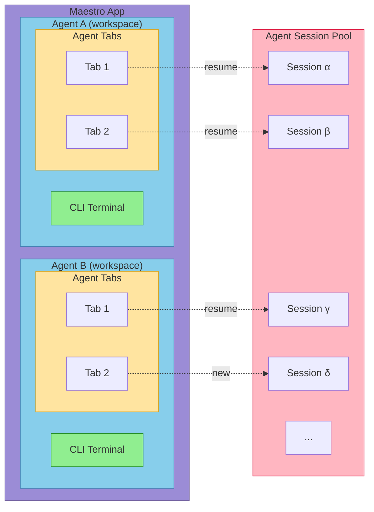

# Architecture Guide

Deep technical documentation for Maestro's architecture and design patterns. For quick reference, see [CLAUDE.md](CLAUDE.md). For development setup, see [CONTRIBUTING.md](CONTRIBUTING.md).

## Table of Contents

- [Dual-Process Architecture](#dual-process-architecture)
- [IPC Security Model](#ipc-security-model)
- [Process Manager](#process-manager)
- [Layer Stack System](#layer-stack-system)
- [Custom Hooks](#custom-hooks)
- [Services Layer](#services-layer)
- [Custom AI Commands](#custom-ai-commands)
- [Theme System](#theme-system)
- [Settings Persistence](#settings-persistence)
- [Claude Sessions API](#claude-sessions-api)
- [Auto Run System](#auto-run-system)
- [Achievement System](#achievement-system)
- [AI Tab System](#ai-tab-system)
- [Execution Queue](#execution-queue)
- [Navigation History](#navigation-history)
- [Group Chat System](#group-chat-system)
- [Web/Mobile Interface](#webmobile-interface)
- [CLI Tool](#cli-tool)
- [Shared Module](#shared-module)
- [Remote Access & Tunnels](#remote-access--tunnels)
- [Error Handling Patterns](#error-handling-patterns)

---

## Architecture

Maestro organizes work into **Projects** (workspaces), each with a **CLI Terminal** and multiple **Agent Tabs**. Each tab can be connected to an **Agent Session** - either newly created or resumed from the session pool.



## Dual-Process Architecture

Maestro uses Electron's main/renderer split with strict context isolation.

### Main Process (`src/main/`)

Node.js backend with full system access:

| File | Purpose |
|------|---------|
| `index.ts` | App entry, IPC handlers, window management |
| `process-manager.ts` | PTY and child process spawning |
| `web-server.ts` | Fastify HTTP/WebSocket server for mobile remote control |
| `agent-detector.ts` | Auto-detect CLI tools via PATH |
| `preload.ts` | Secure IPC bridge via contextBridge |
| `tunnel-manager.ts` | Cloudflare tunnel management for secure remote access |
| `themes.ts` | Theme definitions for web interface (mirrors renderer themes) |
| `utils/execFile.ts` | Safe command execution utility |
| `utils/logger.ts` | System logging with levels |
| `utils/shellDetector.ts` | Detect available shells |
| `utils/terminalFilter.ts` | Strip terminal control sequences |
| `utils/cliDetection.ts` | CLI tool detection (cloudflared, gh) |
| `utils/networkUtils.ts` | Network utilities for local IP detection |

### Renderer Process (`src/renderer/`)

React frontend with no direct Node.js access:

| Directory | Purpose |
|-----------|---------|
| `components/` | React UI components |
| `hooks/` | Custom React hooks (15 hooks - see [Custom Hooks](#custom-hooks)) |
| `services/` | IPC wrappers (git.ts, process.ts) |
| `contexts/` | React contexts (LayerStackContext, ToastContext) |
| `constants/` | Themes, shortcuts, modal priorities |
| `types/` | TypeScript definitions |
| `utils/` | Frontend utilities |

### Session Model

Each session runs **two processes simultaneously**:

```typescript
interface Session {
  id: string;                    // Unique identifier
  aiPid: number;                 // AI agent process (suffixed -ai)
  terminalPid: number;           // Terminal process (suffixed -terminal)
  inputMode: 'ai' | 'terminal';  // Which process receives input
  // ... other fields
}
```

This enables seamless switching between AI and terminal modes without process restarts.

---

## IPC Security Model

All renderer-to-main communication uses the preload script:

- **Context isolation**: Enabled (renderer has no Node.js access)
- **Node integration**: Disabled (no `require()` in renderer)
- **Preload script**: Exposes minimal API via `contextBridge.exposeInMainWorld('maestro', ...)`

### The `window.maestro` API

```typescript
window.maestro = {
  // Core persistence
  settings: { get, set, getAll },
  sessions: { getAll, setAll },
  groups: { getAll, setAll },
  history: { getAll, setAll },  // Command history persistence

  // Process management
  process: { spawn, write, interrupt, kill, resize, runCommand, onData, onExit, onSessionId, onStderr, onCommandExit, onUsage },

  // Git operations (expanded)
  git: {
    status, diff, isRepo, numstat,
    branches, tags, branch, log, show, showFile,
    // Worktree operations
    worktreeInfo, worktreeSetup, worktreeCheckout, getRepoRoot,
    // PR creation
    createPR, getDefaultBranch, checkGhCli
  },

  // File system
  fs: { readDir, readFile },

  // Agent management
  agents: { detect, get, getConfig, setConfig, getConfigValue, setConfigValue },

  // Claude Code integration
  claude: { listSessions, readSessionMessages, searchSessions, getGlobalStats, onGlobalStatsUpdate },

  // UI utilities
  dialog: { selectFolder },
  fonts: { detect },
  shells: { detect },
  shell: { openExternal },
  devtools: { open, close, toggle },

  // Logging
  logger: { log, getLogs, clearLogs, setLogLevel, getLogLevel, setMaxLogBuffer, getMaxLogBuffer },

  // Web/remote interface
  webserver: { getUrl, getClientCount },
  web: { broadcastUserInput, broadcastAutoRunState, broadcastTabChange },
  live: { setSessionLive, getSessionLive },
  tunnel: { start, stop, getStatus, onStatusChange },

  // Auto Run
  autorun: { listDocs, readDoc, writeDoc, saveImage, deleteImage, listImages },
  playbooks: { list, create, update, delete },

  // Attachments & temp files
  attachments: { save, list, delete, clear },
  tempfile: { write, read, delete },

  // Activity & notifications
  cli: { trackActivity, getActivity },
  notification: { show, speak },
}
```

---

## Process Manager

The `ProcessManager` class (`src/main/process-manager.ts`) handles two process types:

### PTY Processes (via `node-pty`)

Used for terminal sessions with full shell emulation:
- `toolType: 'terminal'`
- Supports resize, ANSI escape codes, interactive shell
- Spawned with shell (zsh, bash, fish, etc.)

### Child Processes (via `child_process.spawn`)

Used for AI assistants:
- All non-terminal tool types
- Direct stdin/stdout/stderr capture
- **Security**: Uses `spawn()` with `shell: false`

### Batch Mode (Claude Code)

Claude Code runs in batch mode with `--print --output-format json`:
- Prompt passed as CLI argument
- Process exits after response
- JSON response parsed for result and usage stats

### Stream-JSON Mode (with images)

When images are attached:
- Uses `--input-format stream-json --output-format stream-json`
- Message sent via stdin as JSONL
- Supports multimodal input

### Process Events

```typescript
processManager.on('data', (sessionId, data) => { ... });
processManager.on('exit', (sessionId, code) => { ... });
processManager.on('usage', (sessionId, usageStats) => { ... });
processManager.on('session-id', (sessionId, agentSessionId) => { ... });
processManager.on('stderr', (sessionId, data) => { ... });
processManager.on('command-exit', (sessionId, code) => { ... });
```

---

## Layer Stack System

Centralized modal/overlay management with predictable Escape key handling.

### Problem Solved

- Previously had 9+ scattered Escape handlers
- Brittle modal detection with massive boolean checks
- Inconsistent focus management

### Architecture

| File | Purpose |
|------|---------|
| `hooks/useLayerStack.ts` | Core layer management hook |
| `contexts/LayerStackContext.tsx` | Global Escape handler (capture phase) |
| `constants/modalPriorities.ts` | Priority values for all modals |
| `types/layer.ts` | Layer type definitions |

### Modal Priority Hierarchy

```typescript
const MODAL_PRIORITIES = {
  STANDING_OVATION: 1100,      // Achievement celebration overlay
  CONFIRM: 1000,               // Highest - confirmation dialogs
  PLAYBOOK_DELETE_CONFIRM: 950,
  PLAYBOOK_NAME: 940,
  RENAME_INSTANCE: 900,
  RENAME_TAB: 880,
  RENAME_GROUP: 850,
  CREATE_GROUP: 800,
  NEW_INSTANCE: 750,
  AGENT_PROMPT_COMPOSER: 730,
  PROMPT_COMPOSER: 710,
  QUICK_ACTION: 700,           // Command palette (Cmd+K)
  TAB_SWITCHER: 690,
  AGENT_SESSIONS: 680,
  EXECUTION_QUEUE_BROWSER: 670,
  BATCH_RUNNER: 660,
  SHORTCUTS_HELP: 650,
  HISTORY_HELP: 640,
  AUTORUNNER_HELP: 630,
  HISTORY_DETAIL: 620,
  ABOUT: 600,
  PROCESS_MONITOR: 550,
  LOG_VIEWER: 500,
  SETTINGS: 450,
  GIT_DIFF: 200,
  GIT_LOG: 190,
  LIGHTBOX: 150,
  FILE_PREVIEW: 100,
  SLASH_AUTOCOMPLETE: 50,
  TEMPLATE_AUTOCOMPLETE: 40,
  FILE_TREE_FILTER: 30,        // Lowest
};
```

### Registering a Modal

```typescript
import { useLayerStack } from '../contexts/LayerStackContext';
import { MODAL_PRIORITIES } from '../constants/modalPriorities';

const { registerLayer, unregisterLayer, updateLayerHandler } = useLayerStack();
const layerIdRef = useRef<string>();

// Use ref to avoid re-registration when callback identity changes
const onCloseRef = useRef(onClose);
onCloseRef.current = onClose;

useEffect(() => {
  if (modalOpen) {
    const id = registerLayer({
      type: 'modal',
      priority: MODAL_PRIORITIES.YOUR_MODAL,
      blocksLowerLayers: true,
      capturesFocus: true,
      focusTrap: 'strict',  // 'strict' | 'lenient' | 'none'
      ariaLabel: 'Your Modal Name',
      onEscape: () => onCloseRef.current(),
    });
    layerIdRef.current = id;
    return () => unregisterLayer(id);
  }
}, [modalOpen, registerLayer, unregisterLayer]);  // onClose NOT in deps
```

### Layer Types

```typescript
type ModalLayer = {
  type: 'modal';
  priority: number;
  blocksLowerLayers: boolean;
  capturesFocus: boolean;
  focusTrap: 'strict' | 'lenient' | 'none';
  ariaLabel?: string;
  onEscape: () => void;
  onBeforeClose?: () => Promise<boolean>;
  isDirty?: boolean;
  parentModalId?: string;
};

type OverlayLayer = {
  type: 'overlay';
  priority: number;
  blocksLowerLayers: boolean;
  capturesFocus: boolean;
  focusTrap: 'strict' | 'lenient' | 'none';
  ariaLabel?: string;
  onEscape: () => void;
  allowClickOutside: boolean;
};
```

### Internal Search Layers

Components like FilePreview handle internal search in their onEscape:

```typescript
onEscape: () => {
  if (searchOpen) {
    setSearchOpen(false);  // First Escape closes search
  } else {
    closePreview();        // Second Escape closes preview
  }
}
```

---

## Custom Hooks

Maestro uses 15 custom hooks for state management and functionality.

### Core Hooks

#### useSettings (`src/renderer/hooks/useSettings.ts`)

Manages all application settings with automatic persistence.

**What it manages:**
- LLM settings (provider, model, API key)
- Agent settings (default agent, custom agent paths)
- Shell settings (default shell)
- Font settings (family, size, custom fonts)
- UI settings (theme, enter-to-send modes, panel widths, markdown mode)
- Terminal settings (width)
- Logging settings (level, buffer size)
- Output settings (max lines)
- Keyboard shortcuts
- Custom AI commands

#### useSessionManager (`src/renderer/hooks/useSessionManager.ts`)

Manages sessions and groups with CRUD operations.

**Key methods:**
- `createNewSession(agentId, workingDir, name)` - Creates new session with dual processes
- `deleteSession(id, showConfirmation)` - Delete with confirmation
- `toggleInputMode()` - Switch between AI and terminal mode
- `updateScratchPad(content)` - Update session scratchpad
- `createNewGroup(name, emoji, moveSession, activeSessionId)`
- Drag and drop handlers

#### useFileTreeManagement (`src/renderer/hooks/useFileTreeManagement.ts`)

Manages file tree refresh/filter state and git-related file metadata.

**Key methods:**
- `refreshFileTree(sessionId)` - Reload directory tree and return change stats
- `refreshGitFileState(sessionId)` - Refresh tree + git repo metadata
- `filteredFileTree` - Derived tree based on filter string

#### useBatchProcessor (`src/renderer/hooks/useBatchProcessor.ts`)

Manages Auto Run batch execution logic.

**Key methods:**
- `startBatchRun(config)` - Start batch document processing
- `stopBatchRun()` - Stop current batch run
- `pauseBatchRun()` / `resumeBatchRun()` - Pause/resume execution

### UI Management Hooks

#### useLayerStack (`src/renderer/hooks/useLayerStack.ts`)

Core layer management for modals and overlays.

**Key methods:**
- `registerLayer(config)` - Register a modal/overlay
- `unregisterLayer(id)` - Remove a layer
- `updateLayerHandler(id, handler)` - Update escape handler

#### useNavigationHistory (`src/renderer/hooks/useNavigationHistory.ts`)

Back/forward navigation through sessions and tabs. See [Navigation History](#navigation-history).

### Input & Autocomplete Hooks

#### useAtMentionCompletion (`src/renderer/hooks/useAtMentionCompletion.ts`)

Handles @-mention autocomplete for file references in prompts.

#### useTabCompletion (`src/renderer/hooks/useTabCompletion.ts`)

Tab completion utilities for terminal-style input.

#### useTemplateAutocomplete (`src/renderer/hooks/useTemplateAutocomplete.ts`)

Template variable autocomplete (e.g., `{{date}}`, `{{time}}`).

### Feature Hooks

#### useAchievements (`src/renderer/hooks/useAchievements.ts`)

Achievement/badge system for Auto Run usage. See [Achievement System](#achievement-system).

#### useActivityTracker (`src/renderer/hooks/useActivityTracker.ts`)

User activity tracking for session idle detection and status.

#### useMobileLandscape (`src/renderer/hooks/useMobileLandscape.ts`)

Mobile landscape orientation detection for responsive layouts.

---

## Services Layer

Services provide clean wrappers around IPC calls.

### Git Service (`src/renderer/services/git.ts`)

```typescript
import { gitService } from '../services/git';

const isRepo = await gitService.isRepo(cwd);
const status = await gitService.getStatus(cwd);
// Returns: { files: [{ path: string, status: string }] }

const diff = await gitService.getDiff(cwd, ['file1.ts']);
// Returns: { diff: string }

const numstat = await gitService.getNumstat(cwd);
// Returns: { files: [{ path, additions, deletions }] }
```

### Process Service (`src/renderer/services/process.ts`)

```typescript
import { processService } from '../services/process';

await processService.spawn(config);
await processService.write(sessionId, 'input\n');
await processService.interrupt(sessionId);  // SIGINT/Ctrl+C
await processService.kill(sessionId);
await processService.resize(sessionId, cols, rows);

const unsubscribe = processService.onData((sessionId, data) => { ... });
```

---

## Custom AI Commands

User-defined prompt macros that expand when typed. The built-in slash commands (`/clear`, `/jump`, `/history`) have been deprecated in favor of fully customizable commands defined in Settings.

### Overview

Custom AI Commands are prompt templates that:
- Start with `/` prefix
- Expand to full prompts when selected
- Support template variables (e.g., `{{date}}`, `{{time}}`, `{{cwd}}`)
- Can be AI-only, terminal-only, or both modes

### Configuration

Commands are defined in Settings → Custom AI Commands:

```typescript
interface CustomAICommand {
  command: string;           // e.g., "/review"
  description: string;       // Shown in autocomplete
  prompt: string;            // The expanded prompt text
  aiOnly?: boolean;          // Only show in AI mode
  terminalOnly?: boolean;    // Only show in terminal mode
}
```

### Template Variables

Commands support these template variables:
- `{{date}}` - Current date (YYYY-MM-DD)
- `{{time}}` - Current time (HH:MM:SS)
- `{{datetime}}` - Combined date and time
- `{{cwd}}` - Current working directory
- `{{session}}` - Session name
- `{{agent}}` - Agent type (claude-code, etc.)

### Example Commands

```typescript
// Code review command
{
  command: '/review',
  description: 'Review staged changes',
  prompt: 'Review the staged git changes and provide feedback on code quality, potential bugs, and improvements.',
  aiOnly: true
}

// Status check
{
  command: '/status',
  description: 'Project status summary',
  prompt: 'Give me a brief status of this project as of {{datetime}}. What files have been modified recently?',
  aiOnly: true
}
```

### Claude Code CLI Commands

Maestro also fetches slash commands from Claude Code CLI when available, making Claude Code's built-in commands accessible through the same autocomplete interface.

---

## Theme System

Themes defined in `src/renderer/constants/themes.ts`.

### Theme Structure

```typescript
interface Theme {
  id: ThemeId;
  name: string;
  mode: 'light' | 'dark' | 'vibe';
  colors: {
    bgMain: string;           // Main content background
    bgSidebar: string;        // Sidebar background
    bgActivity: string;       // Accent background
    border: string;           // Border colors
    textMain: string;         // Primary text
    textDim: string;          // Secondary text
    accent: string;           // Accent color
    accentDim: string;        // Dimmed accent
    accentText: string;       // Accent text color
    accentForeground: string; // Text ON accent backgrounds (contrast)
    success: string;          // Success state (green)
    warning: string;          // Warning state (yellow)
    error: string;            // Error state (red)
  };
}
```

### Available Themes

**Dark themes:** Dracula, Monokai, Nord, Tokyo Night, Catppuccin Mocha, Gruvbox Dark

**Light themes:** GitHub, Solarized, One Light, Gruvbox Light, Catppuccin Latte, Ayu Light

### Usage

Use inline styles for theme colors:
```typescript
style={{ color: theme.colors.textMain }}  // Correct
```

Use Tailwind for layout:
```typescript
className="flex items-center gap-2"  // Correct
```

---

## Settings Persistence

Settings stored via `electron-store`:

**Locations:**
- **macOS**: `~/Library/Application Support/maestro/`
- **Windows**: `%APPDATA%/maestro/`
- **Linux**: `~/.config/maestro/`

**Files:**
- `maestro-settings.json` - User preferences
- `maestro-sessions.json` - Session persistence
- `maestro-groups.json` - Session groups
- `maestro-agent-configs.json` - Per-agent configuration

### Adding New Settings

1. Add state in `useSettings.ts`:
```typescript
const [mySetting, setMySettingState] = useState<MyType>(defaultValue);
```

2. Create wrapper function:
```typescript
const setMySetting = (value: MyType) => {
  setMySettingState(value);
  window.maestro.settings.set('mySetting', value);
};
```

3. Load in useEffect:
```typescript
const saved = await window.maestro.settings.get('mySetting');
if (saved !== undefined) setMySettingState(saved);
```

4. Add to return object and export.

---

## Claude Sessions API

Browse and resume Claude Code sessions from `~/.claude/projects/`.

### Path Encoding

Claude Code encodes project paths by replacing `/` with `-`:
- `/Users/pedram/Projects/Maestro` → `-Users-pedram-Projects-Maestro`

### IPC Handlers

```typescript
// List sessions for a project
const sessions = await window.maestro.claude.listSessions(projectPath);
// Returns: [{ sessionId, projectPath, timestamp, modifiedAt, firstMessage, messageCount, sizeBytes }]

// Read messages with pagination
const { messages, total, hasMore } = await window.maestro.claude.readSessionMessages(
  projectPath,
  sessionId,
  { offset: 0, limit: 20 }
);

// Search sessions
const results = await window.maestro.claude.searchSessions(
  projectPath,
  'query',
  'all'  // 'title' | 'user' | 'assistant' | 'all'
);

// Get global stats across all Claude projects (with streaming updates)
const stats = await window.maestro.claude.getGlobalStats();
// Returns: { totalSessions, totalMessages, totalInputTokens, totalOutputTokens,
//            totalCacheReadTokens, totalCacheCreationTokens, totalCostUsd, totalSizeBytes }

// Subscribe to streaming updates during stats calculation
const unsubscribe = window.maestro.claude.onGlobalStatsUpdate((stats) => {
  console.log(`Progress: ${stats.totalSessions} sessions, $${stats.totalCostUsd.toFixed(2)}`);
  if (stats.isComplete) console.log('Stats calculation complete');
});
// Call unsubscribe() to stop listening
```

### UI Access

- Shortcut: `Cmd+Shift+L`
- Quick Actions: `Cmd+K` → "View Agent Sessions"
- Button in main panel header

---

## Auto Run System

File-based document runner for automating multi-step tasks. Users configure a folder of markdown documents containing checkbox tasks that are processed sequentially by AI agents.

### Component Architecture

| Component | Purpose |
|-----------|---------|
| `AutoRun.tsx` | Main panel showing current document with edit/preview modes |
| `AutoRunSetupModal.tsx` | First-time setup for selecting the Runner Docs folder |
| `AutoRunDocumentSelector.tsx` | Dropdown for switching between markdown documents |
| `BatchRunnerModal.tsx` | Configuration modal for multi-document batch execution |
| `PlaybookNameModal.tsx` | Modal for naming saved playbook configurations |
| `PlaybookDeleteConfirmModal.tsx` | Confirmation modal for playbook deletion |
| `useBatchProcessor.ts` | Hook managing batch execution logic |

### Data Types

```typescript
// Document entry in the batch run queue (supports duplicates)
interface BatchDocumentEntry {
  id: string;              // Unique ID for drag-drop and duplicates
  filename: string;        // Document filename (without .md)
  resetOnCompletion: boolean;  // Uncheck all boxes when done
  isDuplicate: boolean;    // True if this is a duplicate entry
}

// Git worktree configuration for parallel work
interface WorktreeConfig {
  enabled: boolean;              // Whether to use a worktree
  path: string;                  // Absolute path for the worktree
  branchName: string;            // Branch name to use/create
  createPROnCompletion: boolean; // Create PR when Auto Run finishes
}

// Configuration for starting a batch run
interface BatchRunConfig {
  documents: BatchDocumentEntry[];  // Ordered list of docs to run
  prompt: string;                   // Agent prompt template
  loopEnabled: boolean;             // Loop back to first doc when done
  worktree?: WorktreeConfig;        // Optional worktree configuration
}

// Runtime batch processing state
interface BatchRunState {
  isRunning: boolean;
  isStopping: boolean;
  documents: string[];           // Document filenames in order
  currentDocumentIndex: number;  // Which document we're on (0-based)
  currentDocTasksTotal: number;
  currentDocTasksCompleted: number;
  totalTasksAcrossAllDocs: number;
  completedTasksAcrossAllDocs: number;
  loopEnabled: boolean;
  loopIteration: number;         // How many times we've looped
  folderPath: string;
  worktreeActive: boolean;
  worktreePath?: string;
  worktreeBranch?: string;
}

// Saved playbook configuration
interface Playbook {
  id: string;
  name: string;
  createdAt: number;
  updatedAt: number;
  documents: PlaybookDocumentEntry[];
  loopEnabled: boolean;
  prompt: string;
  worktreeSettings?: {
    branchNameTemplate: string;
    createPROnCompletion: boolean;
  };
}
```

### Session Fields

Auto Run state is stored per-session:

```typescript
// In Session interface
autoRunFolderPath?: string;      // Persisted folder path for Runner Docs
autoRunSelectedFile?: string;     // Currently selected markdown filename
autoRunMode?: 'edit' | 'preview'; // Current editing mode
autoRunEditScrollPos?: number;    // Scroll position in edit mode
autoRunPreviewScrollPos?: number; // Scroll position in preview mode
autoRunCursorPosition?: number;   // Cursor position in edit mode
batchRunnerPrompt?: string;       // Custom batch runner prompt
batchRunnerPromptModifiedAt?: number;
```

### IPC Handlers

```typescript
// List markdown files in a directory
'autorun:listDocs': (folderPath: string) => Promise<{ success, files, error? }>

// Read a markdown document
'autorun:readDoc': (folderPath: string, filename: string) => Promise<{ success, content, error? }>

// Write a markdown document
'autorun:writeDoc': (folderPath: string, filename: string, content: string) => Promise<{ success, error? }>

// Save image to folder
'autorun:saveImage': (folderPath: string, docName: string, base64Data: string, extension: string) =>
  Promise<{ success, relativePath, error? }>

// Delete image
'autorun:deleteImage': (folderPath: string, relativePath: string) => Promise<{ success, error? }>

// List images for a document
'autorun:listImages': (folderPath: string, docName: string) => Promise<{ success, images, error? }>

// Playbook CRUD operations
'playbooks:list': (sessionId: string) => Promise<{ success, playbooks, error? }>
'playbooks:create': (sessionId: string, playbook) => Promise<{ success, playbook, error? }>
'playbooks:update': (sessionId: string, playbookId: string, updates) => Promise<{ success, playbook, error? }>
'playbooks:delete': (sessionId: string, playbookId: string) => Promise<{ success, error? }>
```

### Git Worktree Integration

When worktree is enabled, Auto Run operates in an isolated directory:

```typescript
// Check if worktree exists and get branch info
'git:worktreeInfo': (worktreePath: string) => Promise<{
  success: boolean;
  exists: boolean;
  isWorktree: boolean;
  currentBranch?: string;
  repoRoot?: string;
}>

// Create or reuse a worktree
'git:worktreeSetup': (mainRepoCwd: string, worktreePath: string, branchName: string) => Promise<{
  success: boolean;
  created: boolean;
  currentBranch: string;
  branchMismatch: boolean;
}>

// Checkout a branch in a worktree
'git:worktreeCheckout': (worktreePath: string, branchName: string, createIfMissing: boolean) => Promise<{
  success: boolean;
  hasUncommittedChanges: boolean;
}>

// Create PR from worktree branch
'git:createPR': (worktreePath: string, baseBranch: string, title: string, body: string) => Promise<{
  success: boolean;
  prUrl?: string;
}>
```

### Execution Flow

1. **Setup**: User selects Runner Docs folder via `AutoRunSetupModal`
2. **Document Selection**: Documents appear in `AutoRunDocumentSelector` dropdown
3. **Editing**: `AutoRun` component provides edit/preview modes with auto-save (5s debounce)
4. **Batch Configuration**: `BatchRunnerModal` allows ordering documents, enabling loop/reset, configuring worktree
5. **Playbooks**: Save/load configurations for repeated batch runs
6. **Execution**: `useBatchProcessor` hook processes documents sequentially
7. **Progress**: RightPanel shows document and task-level progress

### Write Queue Integration

Without worktree mode, Auto Run tasks queue through the existing execution queue:
- Auto Run tasks are marked as write operations (`readOnlyMode: false`)
- Manual write messages queue behind Auto Run (sequential)
- Read-only operations from other tabs can run in parallel

With worktree mode:
- Auto Run operates in a separate directory
- No queue conflicts with main workspace
- True parallelization enabled

---

## Achievement System

Gamification system that rewards Auto Run usage with conductor-themed badges.

### Components

| Component | Purpose |
|-----------|---------|
| `conductorBadges.ts` | Badge definitions and progression levels |
| `useAchievements.ts` | Achievement tracking and unlock logic |
| `AchievementCard.tsx` | Individual badge display component |
| `StandingOvationOverlay.tsx` | Celebration overlay with confetti animations |

### Badge Progression

15 conductor levels based on cumulative Auto Run time:

| Level | Badge | Time Required |
|-------|-------|---------------|
| 1 | Apprentice Conductor | 1 minute |
| 2 | Junior Conductor | 5 minutes |
| 3 | Assistant Conductor | 15 minutes |
| 4 | Associate Conductor | 30 minutes |
| 5 | Conductor | 1 hour |
| 6 | Senior Conductor | 2 hours |
| 7 | Principal Conductor | 4 hours |
| 8 | Master Conductor | 8 hours |
| 9 | Chief Conductor | 16 hours |
| 10 | Distinguished Conductor | 24 hours |
| 11 | Elite Conductor | 48 hours |
| 12 | Virtuoso Conductor | 72 hours |
| 13 | Legendary Conductor | 100 hours |
| 14 | Mythic Conductor | 150 hours |
| 15 | Transcendent Maestro | 200 hours |

### Standing Ovation

When a new badge is unlocked:
1. `StandingOvationOverlay` displays with confetti animation
2. Badge details shown with celebration message
3. Share functionality available
4. Acknowledgment persisted to prevent re-showing

---

## AI Tab System

Multi-tab support within each session, allowing parallel conversations with separate Claude sessions.

### Features

- **Multiple tabs per session**: Each tab maintains its own Claude session ID
- **Tab management**: Create, close, rename, star tabs
- **Read-only mode**: Per-tab toggle to prevent accidental input
- **Save-to-history toggle**: Per-tab control over history persistence
- **Tab switcher modal**: Quick navigation via `Alt+Cmd+T`
- **Unread filtering**: Filter to show only tabs with unread messages

### Tab Interface

```typescript
interface AITab {
  id: string;
  name: string;
  agentSessionId?: string;    // Separate Claude session per tab
  aiLogs: LogEntry[];          // Tab-specific conversation history
  isStarred: boolean;
  readOnlyMode: boolean;
  saveToHistory: boolean;
  unreadCount: number;
  createdAt: number;
}
```

### Session Fields

```typescript
// In Session interface
aiTabs: AITab[];              // Array of AI tabs
activeAITabId: string;        // Currently active tab ID
```

### Shortcuts

| Shortcut | Action |
|----------|--------|
| `Cmd+T` | New tab |
| `Cmd+W` | Close current tab |
| `Alt+Cmd+T` | Open tab switcher |
| `Cmd+Shift+]` | Next tab |
| `Cmd+Shift+[` | Previous tab |

---

## Execution Queue

Sequential message processing system that prevents race conditions when multiple operations target the same session.

### Components

| Component | Purpose |
|-----------|---------|
| `ExecutionQueueIndicator.tsx` | Shows queue status in tab bar |
| `ExecutionQueueBrowser.tsx` | Modal for viewing/managing queue |

### Queue Item Types

```typescript
interface QueuedItem {
  id: string;
  type: 'message' | 'command';
  content: string;
  tabId: string;
  readOnlyMode: boolean;
  timestamp: number;
  source: 'user' | 'autorun';
}
```

### Behavior

- **Write operations** (readOnlyMode: false) queue sequentially
- **Read-only operations** can run in parallel
- Auto Run tasks queue with regular messages
- Queue visible via indicator in tab bar
- Users can cancel pending items via queue browser

### Session Fields

```typescript
// In Session interface
executionQueue: QueuedItem[];  // Pending operations
isProcessingQueue: boolean;    // Currently processing
```

---

## Navigation History

Back/forward navigation through sessions and tabs, similar to browser history.

### Implementation

`useNavigationHistory` hook maintains a stack of navigation entries:

```typescript
interface NavigationEntry {
  sessionId: string;
  tabId?: string;
  timestamp: number;
}
```

### Behavior

- Maximum 50 entries in history
- Automatic cleanup of invalid entries (deleted sessions/tabs)
- Skips duplicate consecutive entries

### Shortcuts

| Shortcut | Action |
|----------|--------|
| `Cmd+Shift+,` | Navigate back |
| `Cmd+Shift+.` | Navigate forward |

---

## Group Chat System

Multi-agent coordination system where a moderator AI orchestrates conversations between multiple Maestro agents, synthesizing their responses into cohesive answers.

### Architecture Overview

```
┌─────────────────────────────────────────────────────────────────────────┐
│                         GROUP CHAT FLOW                                  │
├─────────────────────────────────────────────────────────────────────────┤
│                                                                          │
│   User sends message                                                     │
│          │                                                               │
│          ▼                                                               │
│   ┌─────────────┐                                                        │
│   │  MODERATOR  │ ◄─── Receives user message + chat history              │
│   └──────┬──────┘                                                        │
│          │                                                               │
│          ▼                                                               │
│   Has @mentions? ───No───► Return directly to user                       │
│          │                                                               │
│         Yes                                                              │
│          │                                                               │
│          ▼                                                               │
│   ┌──────────────────────────────────────┐                               │
│   │      Route to mentioned agents       │                               │
│   │  @AgentA  @AgentB  @AgentC  ...      │                               │
│   └──────────────────────────────────────┘                               │
│          │         │         │                                           │
│          ▼         ▼         ▼                                           │
│   ┌─────────┐ ┌─────────┐ ┌─────────┐                                    │
│   │ Agent A │ │ Agent B │ │ Agent C │  (work in parallel)                │
│   └────┬────┘ └────┬────┘ └────┬────┘                                    │
│        │           │           │                                         │
│        └───────────┴───────────┘                                         │
│                    │                                                     │
│                    ▼                                                     │
│          All agents responded                                            │
│                    │                                                     │
│                    ▼                                                     │
│   ┌─────────────────────────────┐                                        │
│   │  MODERATOR reviews results  │ ◄─── Synthesis round                   │
│   └──────────────┬──────────────┘                                        │
│                  │                                                       │
│                  ▼                                                       │
│   Need more info? ───Yes───► @mention agents again (loop back)           │
│                  │                                                       │
│                 No                                                       │
│                  │                                                       │
│                  ▼                                                       │
│   ┌─────────────────────────────┐                                        │
│   │  Final synthesis to user   │ ◄─── No @mentions = conversation ends  │
│   └─────────────────────────────┘                                        │
│                                                                          │
└─────────────────────────────────────────────────────────────────────────┘
```

### Key Design Principle: Moderator Controls the Flow

The moderator is the traffic controller. After agents respond, the **moderator decides** what happens next:

1. **Continue with agents** - If responses are incomplete or unclear, @mention agents for follow-up
2. **Return to user** - If the question is fully answered, provide a synthesis WITHOUT any @mentions

This allows the moderator to go back and forth with agents as many times as needed until the user's question is properly answered.

### Component Architecture

```
src/main/group-chat/
├── group-chat-storage.ts      # Persistence (JSON files in app data)
├── group-chat-log.ts          # Chat history logging
├── group-chat-moderator.ts    # Moderator process management & prompts
├── group-chat-router.ts       # Message routing logic
└── group-chat-agent.ts        # Participant agent management
```

| Component | Purpose |
|-----------|---------|
| `group-chat-storage.ts` | CRUD operations for group chats, participants, history entries |
| `group-chat-log.ts` | Append-only log of all messages (user, moderator, agents) |
| `group-chat-moderator.ts` | Spawns moderator AI, defines system prompts |
| `group-chat-router.ts` | Routes messages between user, moderator, and agents |
| `group-chat-agent.ts` | Adds/removes participant agents |

### Message Routing

#### Session ID Patterns

The router uses session ID patterns to identify message sources:

| Pattern | Source |
|---------|--------|
| `group-chat-{chatId}-moderator-{timestamp}` | Moderator process |
| `group-chat-{chatId}-participant-{name}-{timestamp}` | Agent participant |

#### Routing Functions

```typescript
// User → Moderator
routeUserMessage(groupChatId, message, processManager, agentDetector, readOnly)

// Moderator → Agents (extracts @mentions, spawns agent processes)
routeModeratorResponse(groupChatId, message, processManager, agentDetector, readOnly)

// Agent → Back to moderator (triggers synthesis when all agents respond)
routeAgentResponse(groupChatId, participantName, message, processManager)

// Synthesis round (after all agents respond)
spawnModeratorSynthesis(groupChatId, processManager, agentDetector)
```

### The Synthesis Flow

When all agents finish responding:

1. `markParticipantResponded()` tracks pending responses
2. When last agent responds, `spawnModeratorSynthesis()` is called
3. Moderator receives all agent responses in chat history
4. Moderator either:
   - **@mentions agents** → Routes back to agents (loop continues)
   - **No @mentions** → Final response to user (loop ends)

This is enforced by `routeModeratorResponse()` which checks for @mentions:

```typescript
// Extract mentions and route to agents
const mentions = extractMentions(message, participants);
if (mentions.length > 0) {
  // Spawn agent processes, track pending responses
  for (const participantName of mentions) {
    // ... spawn batch process for agent
    participantsToRespond.add(participantName);
  }
  pendingParticipantResponses.set(groupChatId, participantsToRespond);
}
// If no mentions, message is logged but no agents are spawned
// = conversation turn complete, ball is back with user
```

### Moderator Prompts

Two key prompts control moderator behavior:

**MODERATOR_SYSTEM_PROMPT** - Base instructions for all moderator interactions:
- Assist user directly for simple questions
- Coordinate agents via @mentions when needed
- Control conversation flow
- Return to user only when answer is complete

**MODERATOR_SYNTHESIS_PROMPT** - Used when reviewing agent responses:
- Synthesize if responses are complete (NO @mentions)
- @mention agents if more info needed
- Keep going until user's question is answered

### Data Flow Example

```
User: "How does @Maestro and @RunMaestro.ai relate?"

1. routeUserMessage()
   - Logs message as "user"
   - Auto-adds @Maestro and @RunMaestro.ai as participants
   - Spawns moderator process with user message

2. Moderator responds: "Let me ask the agents. @Maestro @RunMaestro.ai explain..."
   routeModeratorResponse()
   - Logs message as "moderator"
   - Extracts mentions: ["Maestro", "RunMaestro.ai"]
   - Spawns batch processes for each agent
   - Sets pendingParticipantResponses = {"Maestro", "RunMaestro.ai"}

3. Agent "Maestro" responds
   routeAgentResponse()
   - Logs message as "Maestro"
   - markParticipantResponded() → pendingParticipantResponses = {"RunMaestro.ai"}
   - Not last agent, so no synthesis yet

4. Agent "RunMaestro.ai" responds
   routeAgentResponse()
   - Logs message as "RunMaestro.ai"
   - markParticipantResponded() → pendingParticipantResponses = {} (empty)
   - Last agent! Triggers spawnModeratorSynthesis()

5. Moderator synthesis
   - Receives all agent responses in chat history
   - Decision point:
     a) If needs more info: "@Maestro can you clarify..." → back to step 2
     b) If satisfied: "Here's how they relate..." (no @mentions) → done

6. Final response to user (no @mentions = turn complete)
```

### IPC Handlers

```typescript
// Group chat management
'groupchat:create': (name, moderatorAgentId) => Promise<GroupChat>
'groupchat:get': (id) => Promise<GroupChat | null>
'groupchat:list': () => Promise<GroupChat[]>
'groupchat:delete': (id) => Promise<void>

// Participant management
'groupchat:addParticipant': (chatId, name, agentId, cwd) => Promise<void>
'groupchat:removeParticipant': (chatId, name) => Promise<void>

// Messaging
'groupchat:sendMessage': (chatId, message, readOnly?) => Promise<void>

// State
'groupchat:getMessages': (chatId, limit?) => Promise<GroupChatMessage[]>
'groupchat:getHistory': (chatId) => Promise<GroupChatHistoryEntry[]>
```

### Events

```typescript
// Real-time updates to renderer
groupChatEmitters.emitMessage(chatId, message)           // New message
groupChatEmitters.emitStateChange(chatId, state)         // 'idle' | 'agent-working'
groupChatEmitters.emitParticipantsChanged(chatId, list)  // Participant list updated
groupChatEmitters.emitHistoryEntry(chatId, entry)        // New history entry
groupChatEmitters.emitModeratorUsage(chatId, usage)      // Token usage stats
```

### Storage Structure

```
~/Library/Application Support/maestro/group-chats/
├── {chatId}/
│   ├── chat.json           # Group chat metadata
│   ├── log.jsonl           # Append-only message log
│   └── history.json        # Summarized history entries
```

---

## Web/Mobile Interface

Progressive Web App (PWA) for remote control of Maestro from mobile devices.

### Architecture

```
src/web/
├── index.ts              # Entry point
├── main.tsx              # React entry
├── index.html            # HTML template
├── index.css             # Global styles
├── components/           # Shared components (Button, Card, Input, Badge)
├── hooks/                # Web-specific hooks
├── mobile/               # Mobile-optimized components
├── utils/                # Web utilities
└── public/               # PWA assets (manifest, icons, service worker)
```

### Mobile Components (`src/web/mobile/`)

| Component | Purpose |
|-----------|---------|
| `App.tsx` | Main mobile app shell |
| `TabBar.tsx` | Bottom navigation bar |
| `SessionPillBar.tsx` | Horizontal session selector |
| `CommandInputBar.tsx` | Message input with voice support |
| `MessageHistory.tsx` | Conversation display |
| `ResponseViewer.tsx` | AI response viewer |
| `AutoRunIndicator.tsx` | Auto Run status display |
| `MobileHistoryPanel.tsx` | Command history browser |
| `QuickActionsMenu.tsx` | Quick action shortcuts |
| `SlashCommandAutocomplete.tsx` | Command autocomplete |
| `ConnectionStatusIndicator.tsx` | WebSocket connection status |
| `OfflineQueueBanner.tsx` | Offline message queue indicator |

### Web Hooks (`src/web/hooks/`)

| Hook | Purpose |
|------|---------|
| `useWebSocket.ts` | WebSocket connection management |
| `useSessions.ts` | Session state synchronization |
| `useCommandHistory.ts` | Command history management |
| `useSwipeGestures.ts` | Touch gesture handling |
| `usePullToRefresh.ts` | Pull-to-refresh functionality |
| `useOfflineQueue.ts` | Offline message queuing |
| `useNotifications.ts` | Push notification handling |
| `useDeviceColorScheme.ts` | System theme detection |
| `useUnreadBadge.ts` | Unread message badge |
| `useSwipeUp.ts` | Swipe-up gesture detection |

### Communication

The web interface communicates with the desktop app via WebSocket:

```typescript
// Desktop broadcasts to web clients
window.maestro.web.broadcastUserInput(sessionId, input);
window.maestro.web.broadcastAutoRunState(sessionId, state);
window.maestro.web.broadcastTabChange(sessionId, tabId);

// Web client sends commands back
websocket.send({ type: 'command', sessionId, content });
```

### PWA Features

- Installable as standalone app
- Service worker for offline support
- Push notifications
- Responsive design for phones and tablets

---

## CLI Tool

Command-line interface for headless Maestro operations.

### Architecture

```
src/cli/
├── index.ts              # CLI entry point
├── commands/             # Command implementations
│   ├── list-agents.ts
│   ├── list-groups.ts
│   ├── list-playbooks.ts
│   ├── run-playbook.ts
│   ├── show-agent.ts
│   └── show-playbook.ts
├── output/               # Output formatters
│   ├── formatter.ts      # Human-readable output
│   └── jsonl.ts          # JSONL streaming output
└── services/             # CLI-specific services
    ├── agent-spawner.ts  # Agent process management
    ├── batch-processor.ts # Batch execution logic
    ├── playbooks.ts      # Playbook operations
    └── storage.ts        # Data persistence
```

### Available Commands

| Command | Description |
|---------|-------------|
| `maestro list-agents` | List available AI agents |
| `maestro list-groups` | List session groups |
| `maestro list-playbooks` | List saved playbooks |
| `maestro show-agent <id>` | Show agent details |
| `maestro show-playbook <id>` | Show playbook configuration |
| `maestro run-playbook <id>` | Execute a playbook |

### Output Formats

- **Human-readable**: Formatted tables and text (default)
- **JSONL**: Streaming JSON lines for programmatic use (`--format jsonl`)

---

## Shared Module

Cross-platform code shared between main process, renderer, web, and CLI.

### Files

```
src/shared/
├── index.ts              # Re-exports
├── types.ts              # Shared type definitions
├── theme-types.ts        # Theme interface shared across platforms
├── cli-activity.ts       # CLI activity tracking types
└── templateVariables.ts  # Template variable utilities
```

### Theme Types

```typescript
// Shared theme interface used by renderer, main (web server), and web client
interface Theme {
  id: ThemeId;
  name: string;
  mode: 'light' | 'dark' | 'vibe';
  colors: ThemeColors;
}
```

### Template Variables

Utilities for processing template variables in Custom AI Commands:

```typescript
// Available variables
{{date}}      // YYYY-MM-DD
{{time}}      // HH:MM:SS
{{datetime}}  // Combined
{{cwd}}       // Working directory
{{session}}   // Session name
{{agent}}     // Agent type
```

---

## Remote Access & Tunnels

Secure remote access to Maestro via Cloudflare Tunnels.

### Architecture

| Component | Purpose |
|-----------|---------|
| `tunnel-manager.ts` | Manages cloudflared process lifecycle |
| `utils/cliDetection.ts` | Detects cloudflared installation |
| `utils/networkUtils.ts` | Local IP detection for LAN access |

### Tunnel Manager

```typescript
interface TunnelStatus {
  active: boolean;
  url?: string;          // Public tunnel URL
  error?: string;
}

// IPC API
window.maestro.tunnel.start();
window.maestro.tunnel.stop();
window.maestro.tunnel.getStatus();
window.maestro.tunnel.onStatusChange(callback);
```

### Access Methods

1. **Local Network**: Direct IP access on same network
2. **Cloudflare Tunnel**: Secure public URL for remote access

### Security

- Tunnels require cloudflared CLI installed
- URLs are temporary and change on restart
- No authentication by default (consider network security)

---

## Error Handling Patterns

### IPC Handlers (Main Process)

**Pattern 1: Throw for critical failures**
```typescript
ipcMain.handle('process:spawn', async (_, config) => {
  if (!processManager) throw new Error('Process manager not initialized');
  return processManager.spawn(config);
});
```

**Pattern 2: Try-catch with boolean return**
```typescript
ipcMain.handle('git:isRepo', async (_, cwd) => {
  try {
    const result = await execFileNoThrow('git', ['rev-parse', '--is-inside-work-tree'], cwd);
    return result.exitCode === 0;
  } catch {
    return false;
  }
});
```

### Services (Renderer)

**Pattern: Never throw, return safe defaults**
```typescript
export const gitService = {
  async isRepo(cwd: string): Promise<boolean> {
    try {
      return await window.maestro.git.isRepo(cwd);
    } catch (error) {
      console.error('Git isRepo error:', error);
      return false;
    }
  },
};
```

### React Components

**Pattern: Try-catch with user-friendly errors**
```typescript
const handleFileLoad = async (path: string) => {
  try {
    const content = await window.maestro.fs.readFile(path);
    setFileContent(content);
  } catch (error) {
    console.error('Failed to load file:', error);
    setError('Failed to load file');
  }
};
```

### Summary

| Layer | Pattern |
|-------|---------|
| IPC Handlers | Throw critical, catch optional |
| Services | Never throw, safe defaults |
| ProcessManager | Throw spawn failures, emit runtime events |
| Components | Try-catch async, show UI errors |
| Hooks | Internal catch, expose error state |
